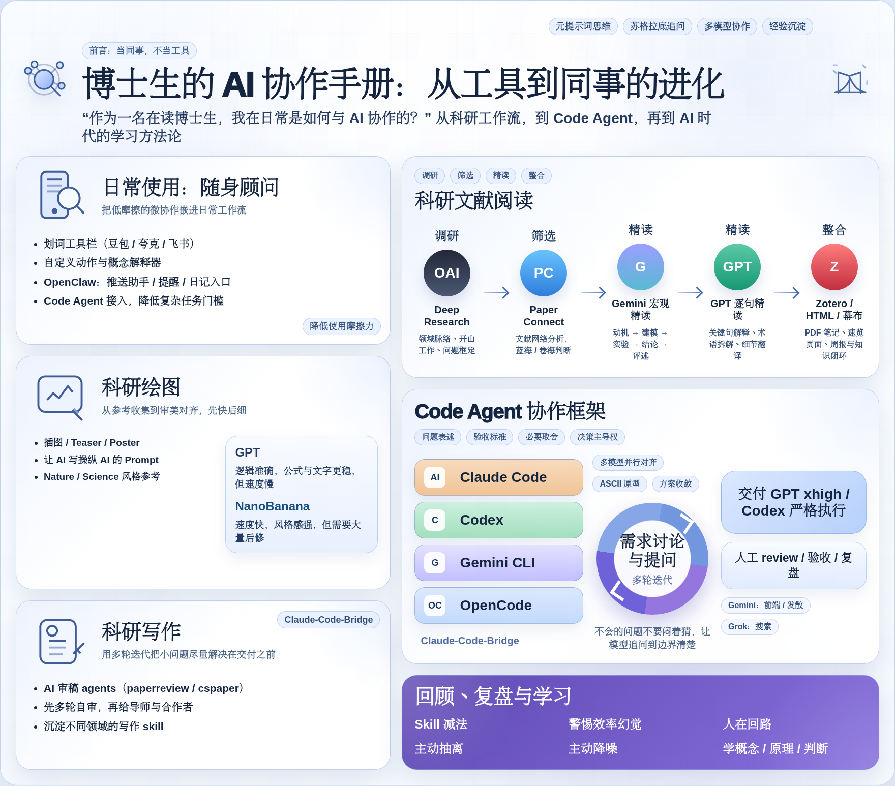
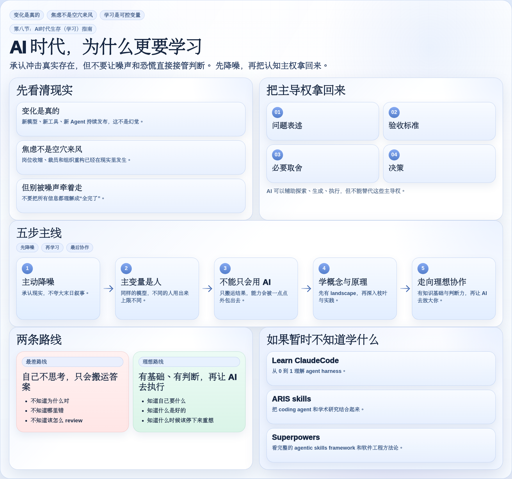
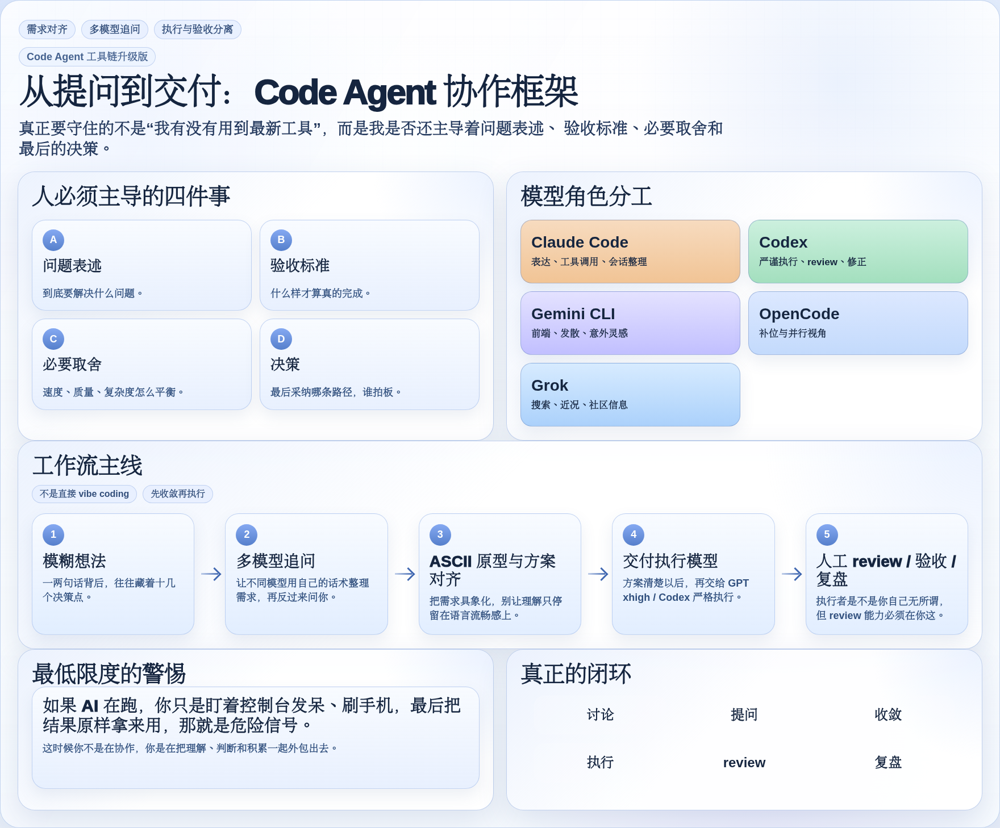
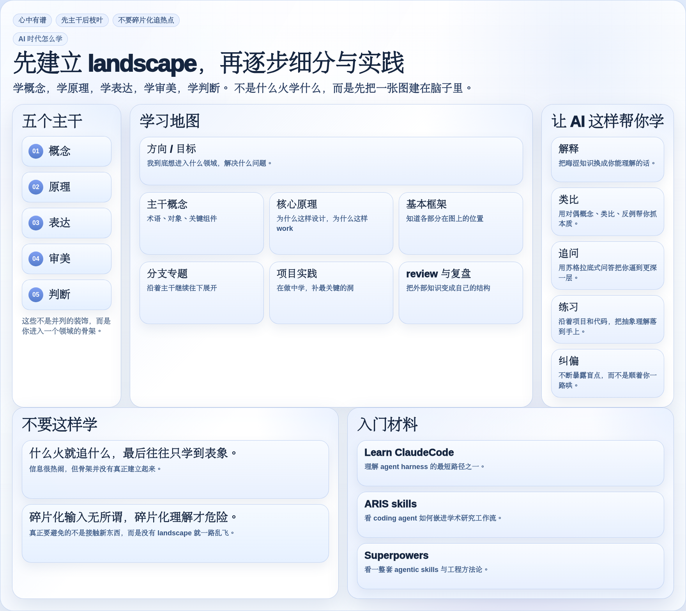

# AI Collab Playbook

[中文](README.md) | English

A Chinese-first personal playbook about **collaborating with AI in real work**: daily academic life, research reading, scientific writing, code-agent workflows, and periodic review.

If you are new here, start with the main article: [`docs/phd-ai-collab.md`](docs/phd-ai-collab.md).

## Start Here

- **Main article (2026-03-20 edition)**: [`docs/phd-ai-collab.md`](docs/phd-ai-collab.md)
- **Update cadence**: the public version is usually synced on Fridays, with occasional earlier updates when there are substantial changes.
- **Linux.do discussion**: <https://linux.do/t/topic/1667121>
- **Xiaohongshu post**: <https://www.xiaohongshu.com/discovery/item/69ab040f000000001a02d99e?source=webshare&xhsshare=pc_web&xsec_token=LBModFyJ1bo4oqM2YmRbD3X0SpH1wO_Yo72JPNGieHJRo=&xsec_source=pc_share>
- **Working rules**: [`AGENTS.md`](AGENTS.md) / [`CLAUDE.md`](CLAUDE.md)
- **Prompts**: [`prompts/`](prompts)
- **Full skills**: [`skills/full/README.en.md`](skills/full/README.en.md)

## Latest Visual Updates

This update was not just a text revision. The visual layer was rebuilt as well: one refreshed overview poster plus three focused figures for learning, survival strategy, and the code-agent framework.

<table>
  <tr>
    <td align="center">
       
      PhD AI collaboration overview
    </td>
    <td align="center">
       
      AI-era learning guide
    </td>
  </tr>
  <tr>
    <td align="center">
       
      Code agent framework
    </td>
    <td align="center">
       
      AI learning roadmap
    </td>
  </tr>
</table>

## Main Article

The main article is [`docs/phd-ai-collab.md`](docs/phd-ai-collab.md).
It is the best entry point if you want the full picture rather than isolated tips: how I use AI in daily academic work, literature reading, figure making, writing, code-agent workflows, and periodic review.

- [`Read the full article`](docs/phd-ai-collab.md)
- [`View the figures`](docs/figs)
- [`Jump to section 8: AI-era Survival (Learning) Guide`](docs/phd-ai-collab.md#八ai时代生存学习指南)

## Working Rules

- [`AGENTS.md`](AGENTS.md): working rules for Codex and general agents
- [`CLAUDE.md`](CLAUDE.md): working rules for Claude Code style workflows

These two files are the most reusable part of this repository. They reflect a workflow I have iterated on in actual use, not just a list of abstract principles.

## Prompts

These are prompt files I reuse frequently:

- [`prompts/提示词优化器.md`](prompts/提示词优化器.md)
- [`prompts/概念解释器.md`](prompts/概念解释器.md)
- [`prompts/视频时间戳总结.md`](prompts/视频时间戳总结.md)
- [`prompts/论文精读.md`](prompts/论文精读.md)
- [`prompts/论文转网页.md`](prompts/论文转网页.md)

## Full Skills

This README only points to full skills. It does not list the shorter `skills/*.md` index cards.

- **In-repo full skill index**: [`skills/full/README.en.md`](skills/full/README.en.md)

### Skills split into standalone repositories

- [`paper-review-pipeline`](https://github.com/cnfjlhj/paper-review-pipeline)
- [`paperreview`](https://github.com/cnfjlhj/paperreview)
- [`skills-governance`](https://github.com/cnfjlhj/skills-governance)
- [`session-recovery-codex`](https://github.com/cnfjlhj/session-recovery-codex)
- [`collaborating-with-codex`](https://github.com/cnfjlhj/collaborating-with-codex)
- [`xhs-note-creator`](https://github.com/cnfjlhj/xhs-note-creator)
- [`prompt-polisher`](https://github.com/cnfjlhj/prompt-polisher)
- [`writing-anti-ai`](https://github.com/cnfjlhj/writing-anti-ai)
- [`xhs-longform-private-publisher`](https://github.com/cnfjlhj/xhs-longform-private-publisher)

The remaining full skills stay in this repository and can be reached from [`skills/full/README.en.md`](skills/full/README.en.md).

## Notes

- The public files here are the versions I consider suitable for sharing on GitHub, not a mirror of every private local setup I use.
- The mother repo keeps the article, the rules, and the full skill entry points. Skills that become stronger standalone projects can continue to be split out into their own repositories.
